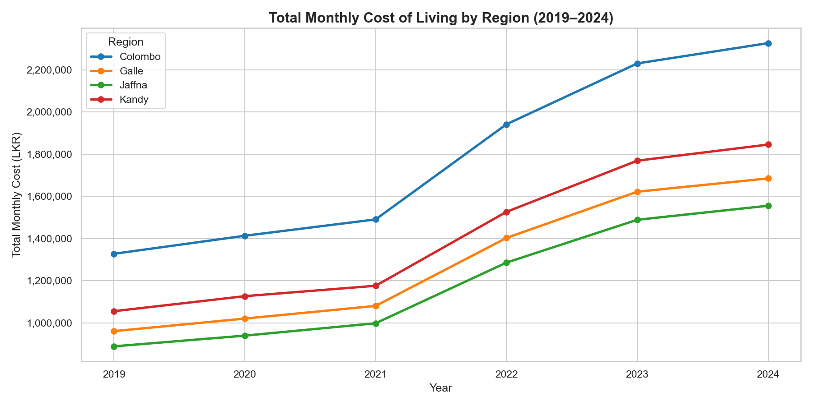
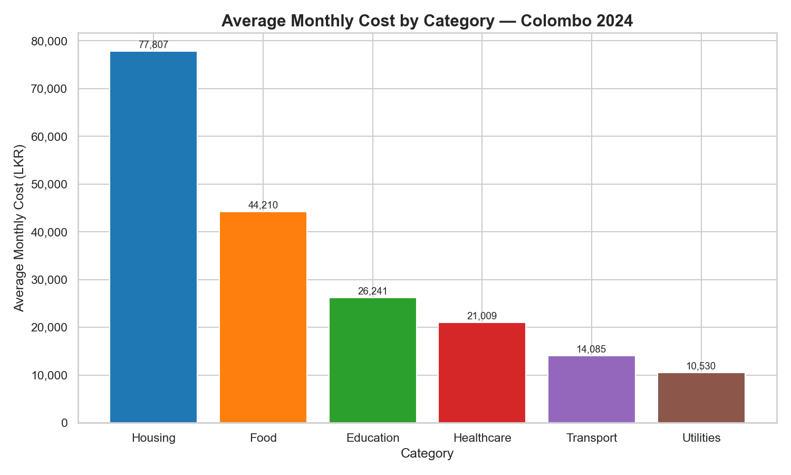
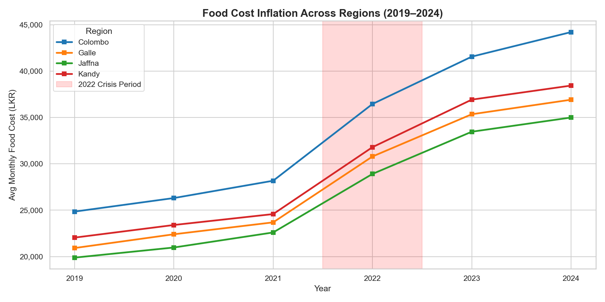
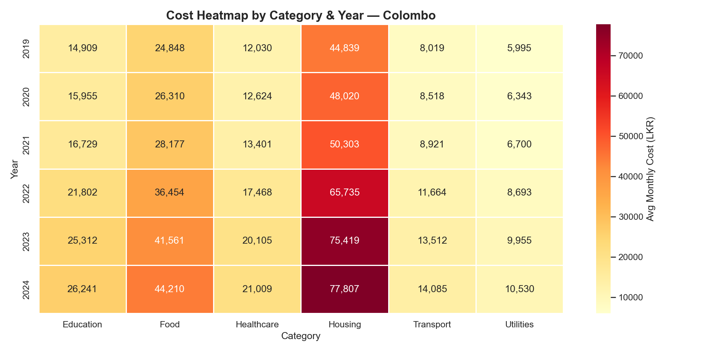
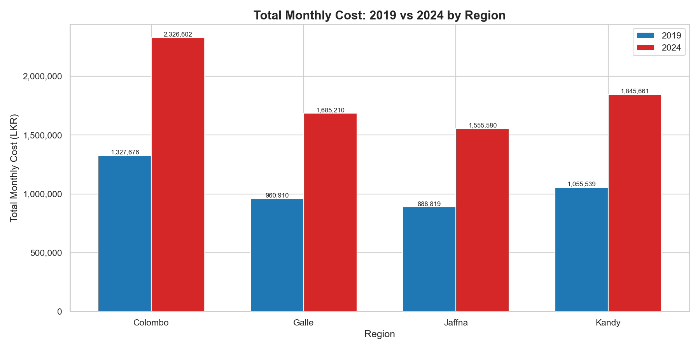

# 🇱🇰 Sri Lanka Cost of Living Analysis (2019–2024)

## 📌 Project Overview
This project analyzes the cost of living across four major regions in Sri Lanka 
(Colombo, Kandy, Galle, and Jaffna) from 2019 to 2024. It examines how the 
2022 economic crisis impacted household expenses across six key categories: 
Food, Transport, Housing, Healthcare, Education, and Utilities.

---

## 🎯 Business Questions Answered
- How did the total cost of living change across regions over 6 years?
- Which expense category puts the most financial pressure on households?
- How severely did the 2022 economic crisis impact food costs?
- Which region is the most and least expensive to live in?
- How much has the overall cost of living grown between 2019 and 2024?

---

## 📊 Key Findings
- **Colombo** remains the most expensive region across all categories
- **Housing** is the single largest monthly expense in all regions
- Food costs saw the sharpest spike during the **2022 crisis**, rising over 45%
- Overall cost of living increased by approximately **75% from 2019 to 2024**
- **Jaffna** offers the most affordable living costs but follows the same inflation trend

---

## 🛠️ Tools & Technologies
| Tool | Purpose |
|------|---------|
| Python | Data generation, analysis, visualization |
| Pandas | Data manipulation and aggregation |
| Matplotlib | Chart creation |
| Seaborn | Heatmap and styled visuals |
| Power BI | Interactive dashboard (see below) |

---

## 📁 Project Structure

    project1-sl-cost-of-living/
    │
    ├── data/
    │   └── sl_cost_of_living.csv       # Dataset (1,728 rows)
    │
    ├── charts/
    │   ├── chart1_cost_by_region.png
    │   ├── chart2_category_breakdown.png
    │   ├── chart3_food_inflation.png
    │   ├── chart4_heatmap.png
    │   └── chart5_2019_vs_2024.png
    │
    ├── generate_dataset.py             # Dataset generation script
    ├── analysis.py                     # Analysis and visualization script
    └── README.md                       # Project documentation

---

## 📈 Visualizations

### Total Monthly Cost by Region (2019–2024)

### Category Breakdown — Colombo 2024

### Food Inflation with 2022 Crisis Highlight

### Cost Heatmap by Category & Year

### 2019 vs 2024 Regional Comparison

---

## 💡 Insights & Recommendations
- Policymakers should prioritize **housing affordability** as the dominant cost burden
- **Food security programs** are critical given the extreme volatility seen in 2022
- Regional cost gaps suggest opportunities for **decentralization policies** to reduce 
  Colombo overcrowding
- Families in **Jaffna and Galle** face lower absolute costs but identical inflation 
  pressure — purchasing power erosion is a nationwide issue

---

## 👩‍💻 Author
**Fathima Nuha** | Data Analyst  
📍 Sri Lanka  

